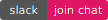

    
     
     

[][website-url]
[][slack-url]

<h1 align="center">Skyflow Composes</h1>

Coming soon 😀

## Documentation

Coming soon 😀

## Contributing

Coming soon 😀

## License

Skyflow-cli is [Apache licensed](LICENSE).

[website-url]: https://skyflow.io
[slack-url]: https://join.slack.com/t/skyflow-cli/shared_invite/enQtNDg4MDIyODQ3Njg0LWYwMTUxZGM3NmQ3MGJhZTA3MDAzNTcwYWM2MzFjNzZmNzAzOWUxZjQ1YTkwMjVkNzU1NjUyMmM2Yjc1ZDI3NzQ